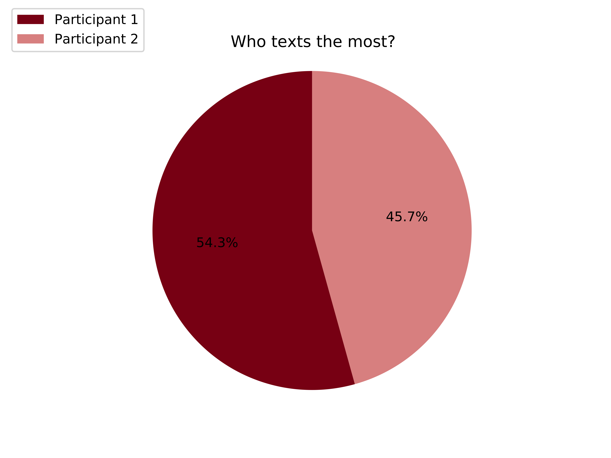
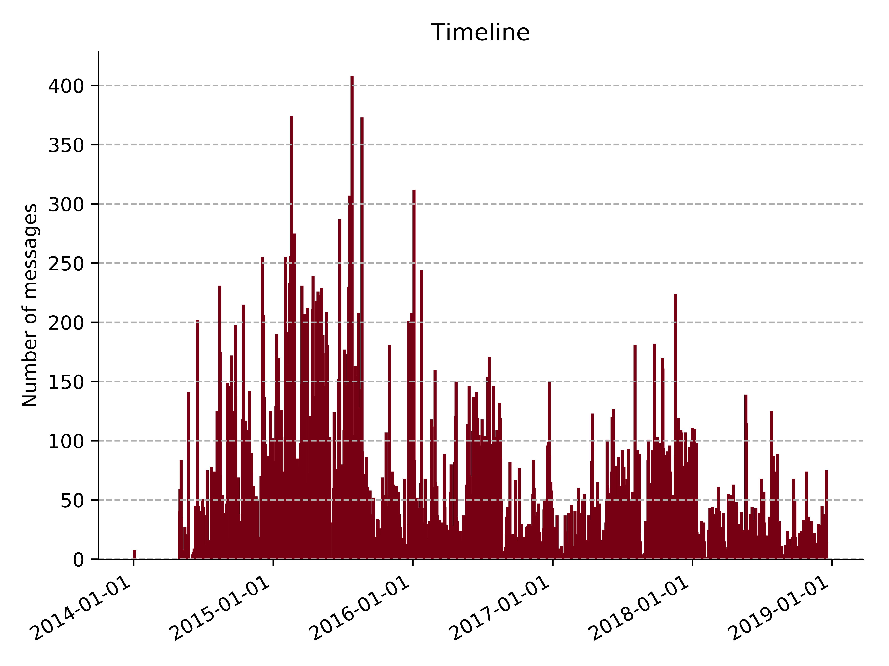
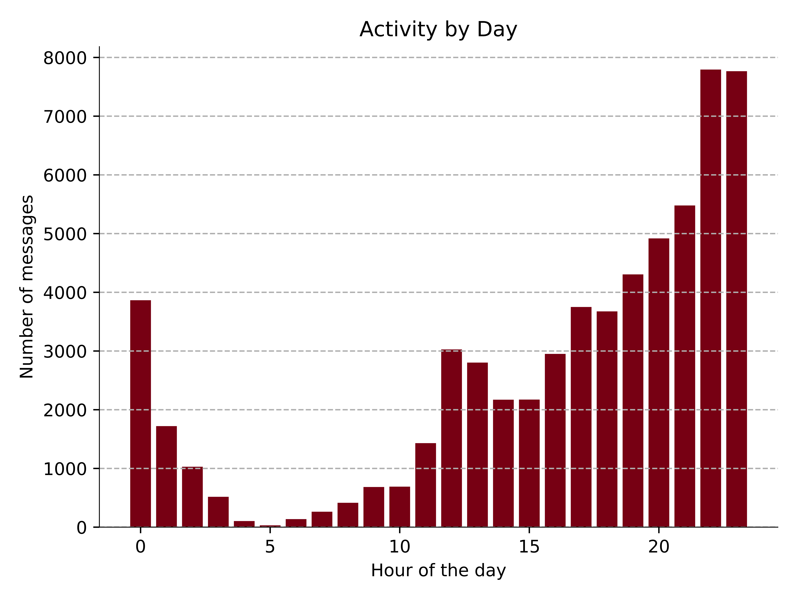
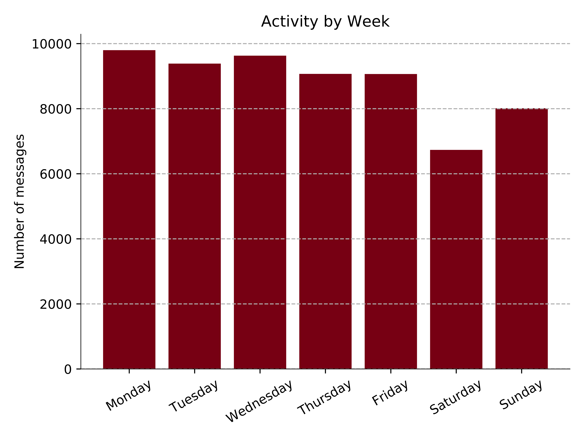
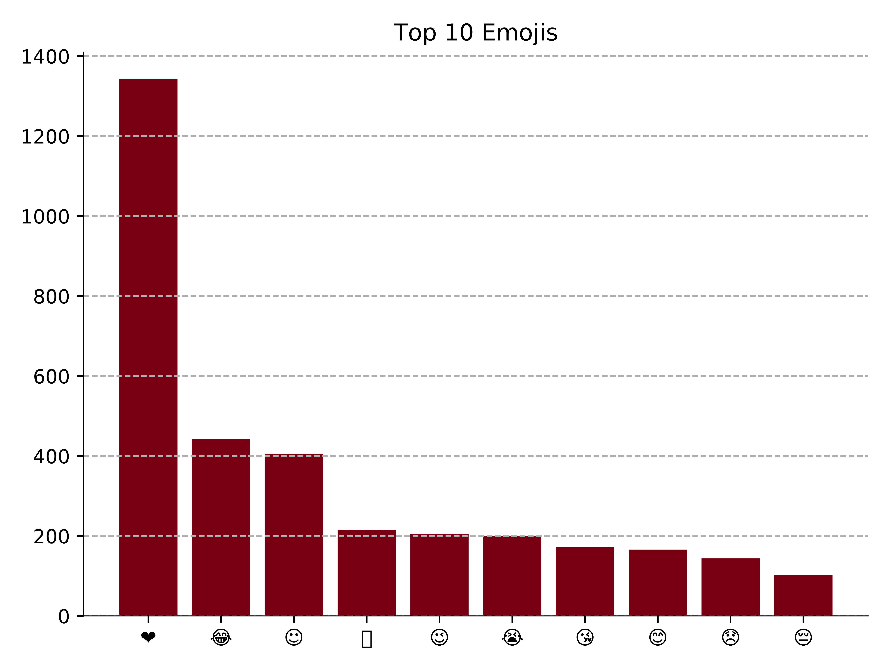

# Facebook Chat Statistics

A small program written in Python 3 that lets you see statistics of any Facebook Messenger conversation. This project started of as a Valentines day surprise for my girlfriend inspired by [this](https://www.reddit.com/r/dataisbeautiful/comments/7xicua/my_girlfriend_made_a_visualization_of_all/) Reddit post.

## Features

The program fetches data such as:

* Start time
* End time
* Number of days
* Number of messages
* Number of words
* Average length of messages
* Average messages per day
* Most used emojis

It also generates a PDF containing the following plots (see pictures below)

* Who texts the most
* Timeline
* Activity by day
* Activity by weekday
* Most used emojis and who sent them

## Images







## Running locally

### Download your Facebook conversations to a .json file
Download your Facebook data by following [these](https://www.facebook.com/help/212802592074644?helpref=uf_permalink) instructions and chosing the format to be JSON. Note that you only have to download your messages in order for this program to work.

### Run it

1. [Download](https://github.com/davidkrantz/FacebookChatStatistics/archive/master.zip) or clone the repository, the latter can be done by typing
```
git clone https://github.com/davidkrantz/FacebookChatStatistics.git
```
in your terminal.

2. Install the needed packages. These are listed in the `requirements.txt` file and *should* be easily installed using `pip` with
```
pip3 install -r /path/to/requirements.txt
```
**NOTE:** The script requires version `<=1.7.0` of the package `emoji`.

3. Change directory to the `FacebookChatStatistics` folder just created. Run the script as below with the path to your JSON conversation as an argument, for example
```
python3 facebook_chat_statistics.py /Path/To/Conversation.json
```
This should generate a PDF including figures similar to the ones above.


**NOTE:** The number of top emojis is default set to 10, but can easily be changed to some other integer by changing the line `nbr_of_top_emojis = 10` in `facebook_chat_statistics.py`.

### Enjoy!
